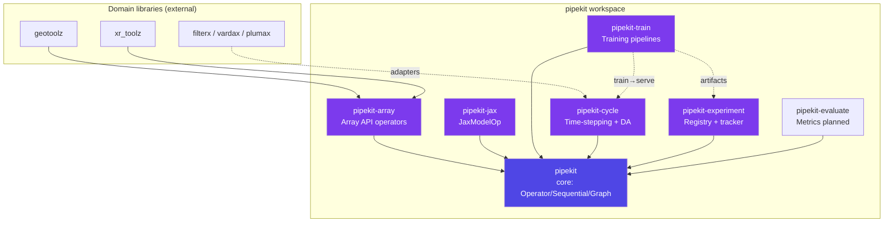

# pipekit

[](https://github.com/jejjohnson/pipekit/actions/workflows/ci.yml)
[](https://github.com/jejjohnson/pipekit/actions/workflows/lint.yml)
[](https://github.com/jejjohnson/pipekit/actions/workflows/typecheck.yml)
[](https://github.com/jejjohnson/pipekit/actions/workflows/pages.yml)
[](https://opensource.org/licenses/MIT)
[](https://github.com/astral-sh/ruff)
[](https://github.com/astral-sh/uv)
[](https://pre-commit.com/)

**Composable scientific pipelines. Train, register, deploy — one
operator interface end-to-end.**

`pipekit` is a uv workspace of seven Python packages that together
turn the pieces of a scientific ML workflow into composable
`Operator`s: data loading, QC, training, data assimilation, model
registry, reproducibility. The same operator that returns a trained
emulator drops into a forecast `Cycle` as a step function. The same
content-hash that identifies your trained model also indexes your
registry. No glue scripts, no separate "train" and "serve" codebases
— one mental model, one composition surface.

```python
from pipekit_cycle import Cycle, NeuralForward
from pipekit_experiment import LocalModelRegistry

# Reload a trained model by name and forecast 24 steps with it
# as the forward model — same Operator interface as inference.
registry = LocalModelRegistry("/models")
op = registry.load("methane_emulator_v3")

forecast = Cycle(step_op=NeuralForward(op, dt=3600.0), n_steps=24)
final_state, _ = forecast(x0, None)
```

---

## 🧭 Where to start

| If you want to…                             | Read this                                              |
|---------------------------------------------|--------------------------------------------------------|
| Understand the mental model in 10 minutes   | [docs/concepts.md](docs/concepts.md)                   |
| Get from `git clone` to a running pipeline  | [docs/getting-started.md](docs/getting-started.md)     |
| Install only the parts you need             | [docs/installation.md](docs/installation.md)           |
| Train an emulator end-to-end                | [docs/tutorials/train-emulator.md](docs/tutorials/train-emulator.md) |
| Run a data-assimilation cycle               | [docs/tutorials/da-cycle.md](docs/tutorials/da-cycle.md) |
| Browse the API reference                    | [jejjohnson.github.io/pipekit](https://jejjohnson.github.io/pipekit/) |
| See what's planned for each package         | The design docs under `packages/*/docs/design/`        |

---

## 📦 Packages



| Package              | Status        | Purpose                                                                  |
|----------------------|---------------|--------------------------------------------------------------------------|
| `pipekit`            | ✅ implemented | Core: `Operator`, `Sequential`, `Graph`, control, observe, …             |
| `pipekit-array`      | 🚧 partial    | Array-API operators (Phase A: namespace + MeanScalar + Stack/Concat).    |
| `pipekit-cycle`      | ✅ implemented | Time-stepping, DA cycles, observation/forward protocols.                 |
| `pipekit-experiment` | ✅ implemented | Content-addressed model registry, tracker protocols, tool adapters.      |
| `pipekit-evaluate`   | 📋 scaffolded | Evaluation metrics, lenses, units (planned).                             |
| `pipekit-train`      | ✅ implemented | Training pipelines — datasets, losses, loop, Equinox adapter.            |
| `pipekit-jax`        | ✅ implemented | `JaxModelOp` — `eqx.Module` wrapper with registry weight round-trip.     |

Each package has its own `README` under [`packages/`](packages/)
with a module inventory and quickstart. Design docs (for the
substantial packages) live under `packages/<pkg>/docs/design/`.

The master plan lives in
[`research_journal_v2/notes/geotoolz/master_plan/`](https://github.com/jejjohnson/research_journal_v2/tree/main/notes/geotoolz/master_plan):
Report 2 covers pipekit core, 3 the sister-library story, 10
pipekit-cycle, 11 pipekit-train, 12 pipekit-experiment.

---

## 🚀 Quick start

```bash
# Prerequisites: uv (https://github.com/astral-sh/uv)
git clone https://github.com/jejjohnson/pipekit.git
cd pipekit
make install      # uv sync --all-groups + pre-commit hooks
make test         # run the full pytest suite (~500 tests)
make docs-serve   # preview the MkDocs site locally
```

For per-package installs (once published to PyPI) see
[docs/installation.md](docs/installation.md).

---

## 🧠 The five things to know

1. **An `Operator` is a class with one method** — `_apply(self,
   carrier) -> carrier`. The carrier is whatever you want (array,
   `xr.Dataset`, dataclass, dict). pipekit doesn't care; sister
   packages narrow it for their domain.
2. **Composition is `|`** — `op1 | op2 | op3` returns a `Sequential`.
   Non-linear flows use `Graph` with named nodes.
3. **State is explicit** — `StatefulOperator` carries
   `(carrier, state) → (carrier, state)`. That's the substrate for
   `Cycle`, `TrainingLoop`, DA.
4. **Backends dispatch on the input** — `pipekit-array`'s
   `array_namespace(x)` picks numpy / JAX / CuPy / PyTorch / dask
   from the array's namespace. One operator runs on all five.
5. **Everything content-hashes** — `op.content_hash` is a stable
   hash of the config. Same operator + same config = same hash.
   That's how `pipekit-experiment.ModelRegistry` indexes trained
   models.

For the long-form version see [docs/concepts.md](docs/concepts.md).

---

## 📂 Repository layout

```
pipekit/
├── packages/
│   ├── pipekit/                  # Core framework (no internal deps)
│   ├── pipekit-array/            # Array-API operators (Phase A landed)
│   ├── pipekit-cycle/            # Time-stepping + DA on top of pipekit.state
│   ├── pipekit-experiment/       # Registry + tracker protocols + tool adapters
│   ├── pipekit-evaluate/         # Scaffold — evaluation metrics (planned)
│   ├── pipekit-train/            # Training pipelines + Equinox adapter
│   └── pipekit-jax/              # JaxModelOp — eqx.Module ↔ ModelRegistry
├── docs/                         # MkDocs documentation source
│   ├── index.md                  # Site homepage
│   ├── concepts.md               # Mental model
│   ├── getting-started.md        # First pipeline / cycle / model
│   ├── installation.md           # Per-package install matrix
│   ├── tutorials/                # End-to-end walkthroughs
│   ├── api/                      # mkdocstrings-generated reference
│   └── notebooks/                # Executed Jupyter notebooks
├── .github/                      # Workflows, issue templates, dependabot, …
├── pyproject.toml                # Workspace config (uv workspace, ruff, pytest)
├── uv.lock                       # Reproducible lockfile
├── Makefile                      # Self-documenting task runner
├── mkdocs.yml                    # Documentation site configuration
├── AGENTS.md                     # Standing instructions for AI coding agents
├── CLAUDE.md                     # Claude-Code-specific architecture notes
└── CHANGELOG.md                  # Auto-generated changelog (release-please)
```

The workspace root `pyproject.toml` ships no Python code — it only
declares the `[tool.uv.workspace]` membership and shared tool config.

---

## 🧰 Tooling

| Concern              | Tool                                                                                  |
|----------------------|---------------------------------------------------------------------------------------|
| Package manager      | [`uv`](https://github.com/astral-sh/uv) with workspace + lockfile                     |
| Lint & format        | [`ruff`](https://github.com/astral-sh/ruff) (line-length 88, py312)                   |
| Type checking        | [`ty`](https://github.com/astral-sh/ty)                                               |
| Tests                | `pytest` (+ `pytest-cov`)                                                             |
| Docs                 | MkDocs + Material + `mkdocstrings` + `mkdocs-jupyter`                                 |
| Pre-commit           | `.pre-commit-config.yaml` + `pre-commit-ci`                                           |
| Releases             | [release-please](https://github.com/googleapis/release-please) (conventional commits) |
| Security             | CodeQL                                                                                |
| Dependency updates   | Dependabot                                                                            |

Every concern is wired into CI on every PR. See
[`.github/workflows/`](.github/workflows/) for the full pipeline.

---

## 🪪 Conventions

- **Conventional commits** — release-please reads commit history to
  generate `CHANGELOG.md` and version bumps. PR titles must start
  with a lowercase subject (`feat:`, `fix:`, `docs:`, …).
- **Google-style docstrings** — enforced by `mkdocstrings` config.
- **Surgical changes** — see [`AGENTS.md`](AGENTS.md) for the
  Karpathy-style guardrails every agent (and human) should follow.
- **Per-package lint never sufficient** — `ruff check .` runs on the
  whole repo because some lint issues only show up across packages
  (test conftest collisions, …).

---

## 📖 Further reading

- [Documentation site](https://jejjohnson.github.io/pipekit/) — full
  docs, API reference, tutorials.
- [`CONTRIBUTING.md`](CONTRIBUTING.md) — local dev workflow.
- [`CODE_REVIEW.md`](CODE_REVIEW.md) — review standards.
- [`AGENTS.md`](AGENTS.md) — guidance for AI coding agents.
- [Design docs](packages/) — under `packages/<pkg>/docs/design/`
  for the substantial packages.
