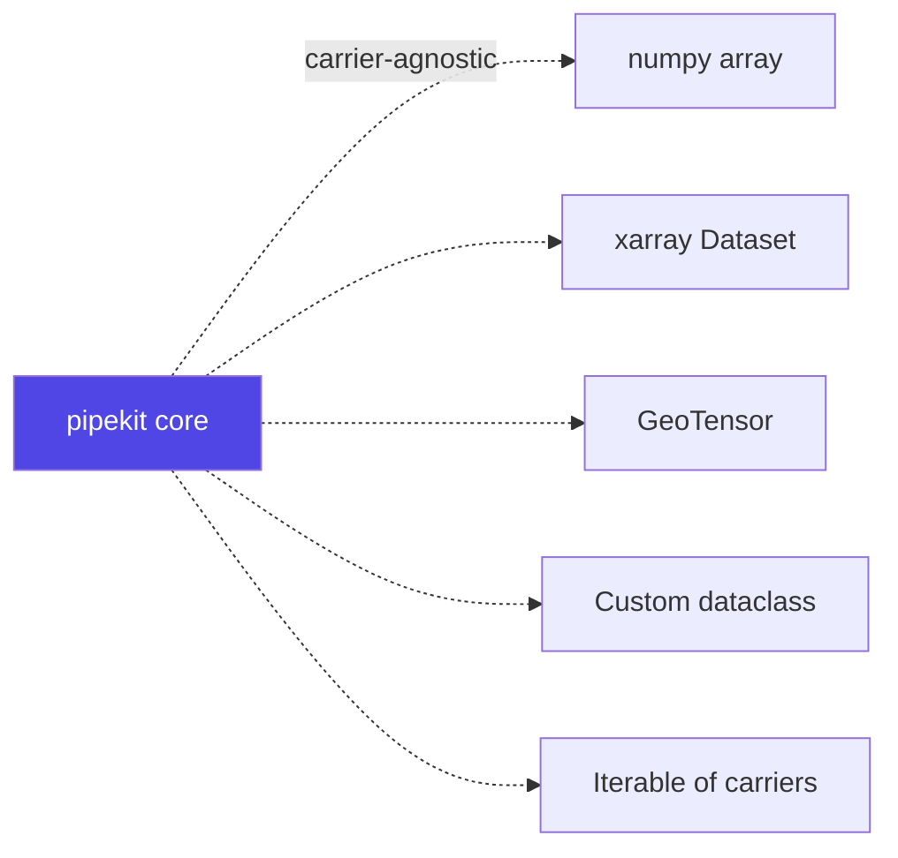
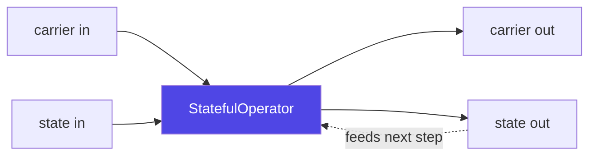

# Concepts

A 10-minute mental model of what `pipekit` is and how the pieces fit
together. If you've used scikit-learn pipelines or Keras's functional
API the shapes will look familiar — pipekit is the same idea
generalised to arbitrary data carriers (arrays, `xr.Dataset`,
`GeoTensor`, custom dataclasses) and extended to data assimilation,
training, and reproducibility.

## The one-paragraph version

You write a small `Operator` class for each piece of work (load, mask,
diff, train, infer, …). pipekit gives you the glue: composition with
`|`, branching / retry / quarantine, structured observation, parallel
mapping, caching, YAML round-trip with content hashing, and a state
substrate for time-stepping. Sister packages add domain pieces on top
(`pipekit-cycle` for data assimilation, `pipekit-train` for training,
`pipekit-array` for Array-API-dispatched numerical operators,
`pipekit-experiment` for the registry / tracker boundary).

## The five things to know

### 1. Operators

An `Operator` is a class with one method: `_apply(self, carrier) ->
carrier`. The carrier can be anything — a numpy array, an xarray
`Dataset`, a `GeoTensor`, a pandas DataFrame, a dataclass, even an
iterable of carriers. The carrier flows through; each operator does
its work and returns the next carrier.

```python
from pipekit import Operator


class Scale(Operator):
    def __init__(self, factor: float) -> None:
        self.factor = factor

    def _apply(self, x):
        return x * self.factor


Scale(2.0)(5.0)  # → 10.0
```

The base class handles `__call__`, configuration round-trip (via
`get_config()`), graph node construction (when used inside `Graph`),
and content hashing. You only implement `_apply`.

### 2. Composition with `|`

The pipe operator chains operators into a `Sequential`:

```python
from pipekit import Sequential, Tap


pipe = Scale(2.0) | Tap(print, name="log") | Scale(3.0)
pipe(5.0)  # → 30.0; the Tap prints "10.0" between scales
```

`Sequential` is itself an `Operator`, so you can compose pipelines
into bigger pipelines.

For non-linear flows — multiple inputs, fan-in, fan-out — use
`Graph` with named nodes:

```python
from pipekit import Graph, Input


g = Graph()
a = g.add(Input("a"))
b = g.add(Input("b"))
total = g.add(MyAdder(), inputs=[a, b])
g.set_outputs([total])
g({"a": 3.0, "b": 4.0})  # → {<total.id>: 7.0}
```

### 3. Carrier-agnostic by design

The framework doesn't know what a "carrier" is. The base `Operator`
class makes no assumptions about shape, dtype, units, or coordinate
system. That's why the same `Operator`, `Sequential`, `Graph`
plumbing works across:



Sister packages specialise. `pipekit-array` operators consume any
Array API conformant array; `pipekit-cycle` operators consume
`(carrier, state)` pairs; domain libraries (`geotoolz`, `xr_toolz`)
ship operators that consume their specific carrier types.

### 4. State carry — `StatefulOperator`

Most operators are stateless: they consume a carrier and emit a
carrier. But some need to track state across calls — a time-stepping
forecast, a training loop, an online statistic. For those, pipekit
core ships `StatefulOperator` and a generic `CarryState` mechanism:



This is the substrate for:

- `pipekit-cycle.Cycle` — N steps of `(carrier, state) → (carrier, state)`
- `pipekit-train.TrainingLoop` — the optimizer state, step count,
  metrics flow as `CarryState` across batches
- `pipekit-cycle.DACycle` — combines a forecast cycle with an
  observation operator and an analysis step

### 5. Backend dispatch — `pipekit-array`

For numerical work, the same operator should run on numpy, JAX,
PyTorch, CuPy, or dask. `pipekit-array` operators dispatch on the
[Python Array API standard][api]:

```python
from pipekit_array import MeanScalar


# Same operator, different backends — picked at call time:
MeanScalar()(numpy_array)    # uses numpy
MeanScalar()(jax_array)      # uses jax.numpy
MeanScalar()(torch_tensor)   # uses array_api_compat.torch
```

[api]: https://data-apis.org/array-api/

The mechanism is `array_namespace(x)` — it returns the
module-like namespace shared by all input arrays. Operators close
over `xp = array_namespace(x)` and use `xp.mean`, `xp.concat`,
`xp.stack`, etc. for the actual math.

## Shape inference (where relevant)

Operators that reshape or reduce can opt into static shape inference
via `compute_output_signature(input_sig) -> Signature | None`:

```python
from pipekit.signature import Signature


sig = Signature(dims=(("band", 3), ("y", 256), ("x", 256)), dtype="float32")
pipe = MeanScalar(axis=0) | Subsample(stride=2)
out_sig = pipe.compute_output_signature(sig)
# Signature(dims=(("y", 128), ("x", 128)), dtype="float32")
```

`Sequential.summary` walks the pipeline and prints a Keras-style
table:

```
Step                   Output Signature           Params
─────────────────────────────────────────────────────────
MeanScalar(axis=0)     (y=256, x=256) float32         0
Subsample(stride=2)    (y=128, x=128) float32         0
```

Operators that don't track shape (raw numpy, `GeoTensor`) return
`None` from `compute_output_signature`; the summary prints `?` for
those steps rather than crashing.

## YAML round-trip and content hashing

Every operator implements `get_config() -> dict[str, Any]` (often
auto-derived from `__init__` parameter names). The framework uses
this for:

- **Serialisation** — `pipekit.serial.dumps(op)` →
  `loads(yaml_text)`. Pipelines round-trip cleanly through YAML.
- **Content hashing** — `op.content_hash` is a stable hash of the
  config. Same operator + same config = same hash, deterministically.
  This is the identifier `pipekit-experiment.ModelRegistry` uses to
  index trained models.

Operators that carry user closures (`Lambda`, `Tap`, custom
callbacks) opt out with `forbid_in_yaml: ClassVar[bool] = True` —
they still work, but their config is a debug repr, not a faithful
round-trip.

## Where to go next

- **[Getting Started](getting-started.md)** — install, your first
  pipeline, your first DA cycle, your first registry round-trip.
- **[Installation](installation.md)** — per-package install matrix
  with every extras combination.
- **[Tutorials](tutorials/train-emulator.md)** — substantive
  walkthroughs: train an emulator, run a DA cycle.
- **[API reference](api/pipekit.md)** — generated from docstrings.
