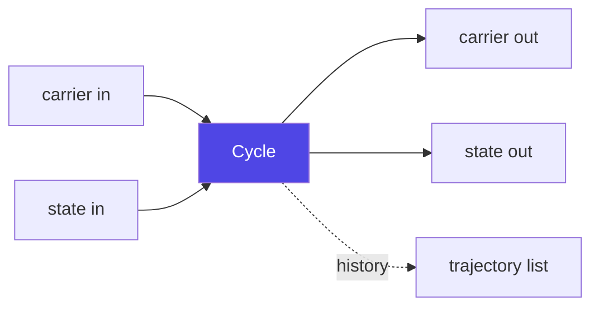

# Tutorial — Run a data-assimilation cycle

Walks through running a forecast-only `Cycle` and a full
data-assimilation `EnsembleDACycle` with `pipekit-cycle`. The DA cycle
plugs in an analysis-step adapter from an external algorithm library
(`filterx`); the pipekit-cycle side stays algorithm-agnostic.

**Time:** ~10 minutes.

**Prerequisites:**

```bash
uv add pipekit-cycle
# For the DA section, also an algorithm library exposing an
# AnalysisStep adapter — e.g. filterx (not bundled).
```

## The core abstraction

A `Cycle` repeatedly applies a step operator to a `(carrier, state)`
pair:



The step operator must satisfy the `ForwardModel` protocol — it
consumes `(carrier, state)` and produces `(carrier, state)`. The
`Cycle` operator handles the looping, history capture, and state
carry.

## Step 1 — Forecast-only `Cycle`

Pick or write a step function. `CallableForward` expects a callable
shaped like `fn(state, dt) -> new_state` — the physical state is the
carrier flowing through the `Cycle`, and `dt` is supplied by the
`CallableForward` wrapper at every step.

```python
import numpy as np
import pipekit_cycle as pc


def damped_oscillator_step(state: np.ndarray, dt: float) -> np.ndarray:
    """One Euler step of dx/dt = v; dv/dt = -kx - cv.

    State layout: ``np.array([x, v])``. k and c are hard-coded for the
    toy example; real models close over them via partial / a class.
    """
    k, c = 1.0, 0.1
    x, v = state[0], state[1]
    new_x = x + dt * v
    new_v = v + dt * (-k * x - c * v)
    return np.array([new_x, new_v], dtype=state.dtype)
```

(Real users use a `numpy`-flavoured stepper from their domain
library; this is just to keep the example self-contained.)

Wrap it as a `ForwardModel`:

```python
step_op = pc.CallableForward(damped_oscillator_step, dt=0.1)
```

Build the `Cycle` and run it. The `Cycle.__call__` signature is
`(carrier, state) -> (carrier, state)`; passing `state=None` is fine
for a forecast-only run with no algorithm-level bookkeeping:

```python
x0 = np.array([1.0, 0.0], dtype=np.float32)
forecast = pc.Cycle(step_op=step_op, n_steps=100, save_history=True)
x_final, _ = forecast(x0, None)

trajectory = forecast.history  # list of (carrier, state) per saved step
```

The trajectory is exactly what you'd plot for a "what does my
forecast look like" diagnostic.

## Step 2 — Add observations and an analysis step

A real DA cycle has three more pieces:

1. **An `ObservationOperator`** — maps the state to observation
   space. `pc.IdentityObs` is the simplest; `pc.LinearObs`,
   `pc.CallableObs`, and `pc.CompositeObs` cover the rest.
2. **An observation source** — an `Operator` that yields observations
   at each step (user-supplied; a `Const` or a `Sequential` reading
   from a queue).
3. **An `AnalysisStep`** — provided by an algorithm library.
   `pipekit-cycle` doesn't ship any. The convention is
   `<libname>.adapters.pipekit.<Algorithm>Analysis`.

Wire them together:

```python
from filterx.adapters.pipekit import EnKFAnalysis  # external lib


da = pc.EnsembleDACycle(
    forward_model=step_op,
    obs_op=pc.IdentityObs(),
    analysis_step=EnKFAnalysis(inflation=1.05),
    obs_source=my_obs_source_op,
    n_steps=24,
    n_members=40,
)

# Pass an ensemble (an array of N initial states) and a DAState
# carrying the observation-error covariance R:
members, state = da(initial_members, pc.DAState(obs_err_cov=R))
```

The `EnsembleDACycle` operator handles ensemble propagation, the
observation operator's batched call across members, and the analysis
update at each step. The algorithm library's `EnKFAnalysis`
implements the math (the Kalman update); pipekit-cycle drives the
loop.

## Step 3 — Other shapes

The `cycle` module ships three more variants:

| Operator         | Shape                                                                                       |
|------------------|---------------------------------------------------------------------------------------------|
| `Cycle`          | Single-trajectory forecast (deterministic).                                                 |
| `EnsembleCycle`  | N-member ensemble; same step applied to all members in parallel.                            |
| `WindowedCycle`  | Sliding-window forecast for 4DVar-style assimilation windows.                               |
| `Recurrence`     | Generic state-carry recurrence (no time semantics; the building block).                     |
| `DACycle`        | Variational / deterministic DA — combines a `Cycle` with an `AnalysisStep` at obs times.    |
| `EnsembleDACycle`| Ensemble DA — combines `EnsembleCycle` with an ensemble-aware `AnalysisStep`.               |
| `SmootherCycle`  | Backwards-in-time smoothing pass over a saved forecast trajectory.                          |

The shape you reach for depends on your algorithm. The pipekit-cycle
side is the same plumbing for all of them.

## Algorithm-library integration

Algorithm libraries plug in by exposing adapter classes that satisfy
the runtime-checkable Protocols in `pipekit_cycle.protocols`. No
pipekit-cycle import is required in the algorithm core; the
conventional location is `<libname>.adapters.pipekit`.

That's why you'll see `filterx.adapters.pipekit.EnKFAnalysis`,
`vardax.adapters.pipekit.FourDVarAnalysis`, etc. The algorithm code
stays pure; the adapter is the pipekit-aware shim.

## What you actually learned

- A `Cycle` is a `StatefulOperator` that loops a forward step and
  optionally records history.
- DA cycles bring in two more pieces: an `ObservationOperator` and
  an `AnalysisStep`. The first is from `pipekit-cycle`; the second
  is from an algorithm library via a thin adapter.
- The protocols are runtime-checkable and don't require imports —
  algorithm libraries don't depend on pipekit-cycle.

## Where to go next

- **[Train an emulator](train-emulator.md)** — train a neural
  surrogate and drop it into a `Cycle` as a `NeuralForward`.
- **[pipekit-cycle README](https://github.com/jejjohnson/pipekit/blob/main/packages/pipekit-cycle/README.md)**
  — module inventory and the full algorithm-library handshake.
- **[Notebook: cycle handoff](../notebooks/pipekit_train_cycle_handoff.ipynb)**
  — train → forecast on a toy oscillator.
